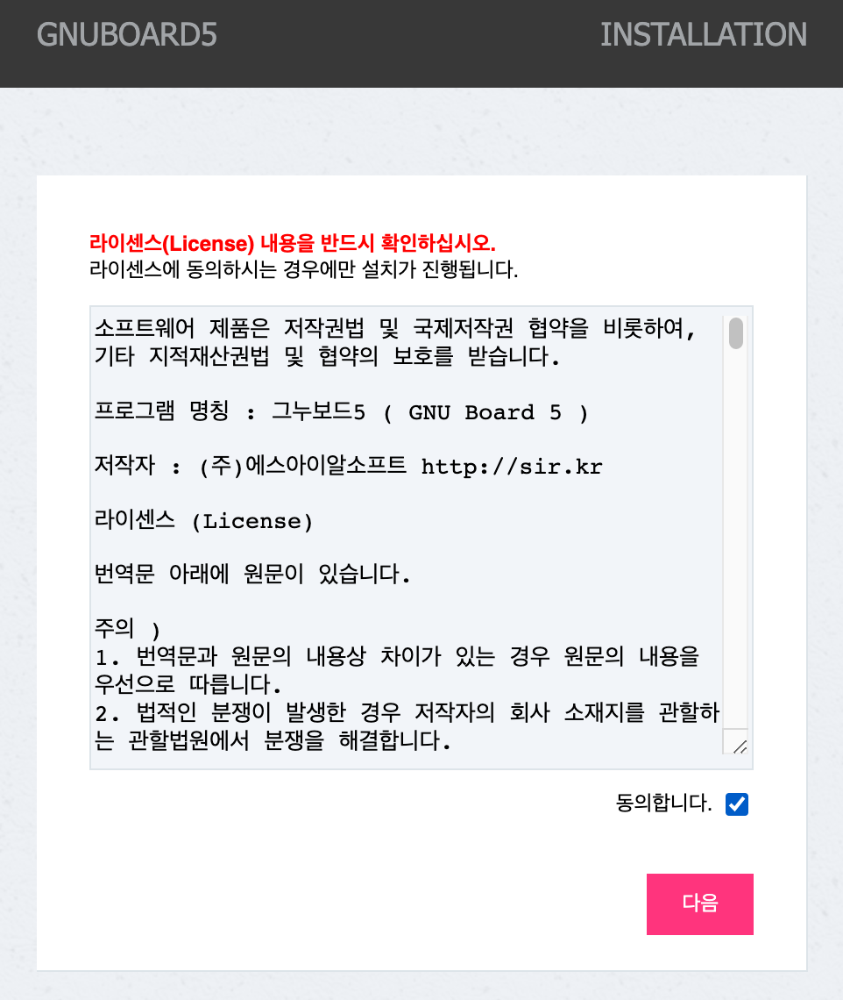
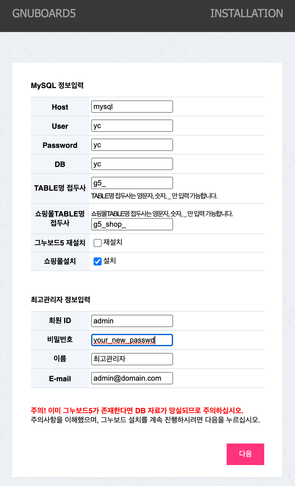
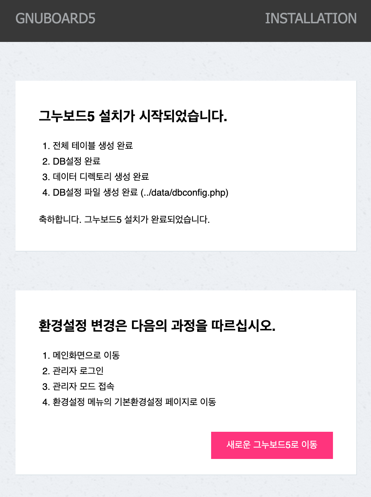

# youngcart5-docker
gnuboard youngcart on docker compose (using nginx + php-fpm + mysql)

## Install and run
### Download source
```sh
git clone https://github.com/huey-hskim/youngcart5-docker.git
```

### Change working directory
```sh
cd youngcart5-docker
```

### Youngcart source download with git submodule
```sh
git submodule init
git submodule update
```

### Run use docker compose (auto build)
```sh
docker compose up -d
```

### Access test
```
http://localhost/yc/
```

## Init youngcart5
### step1
</img>
### step2
</img>
### step3
* db setting info in docker-compose.yml file. show mysql service section.
* host is mysql that is a docker compose service name.

</img>
### step4
</img>

## Enjoy yourself
### Good luck!
```
http://localhost/yc/shop/
```
